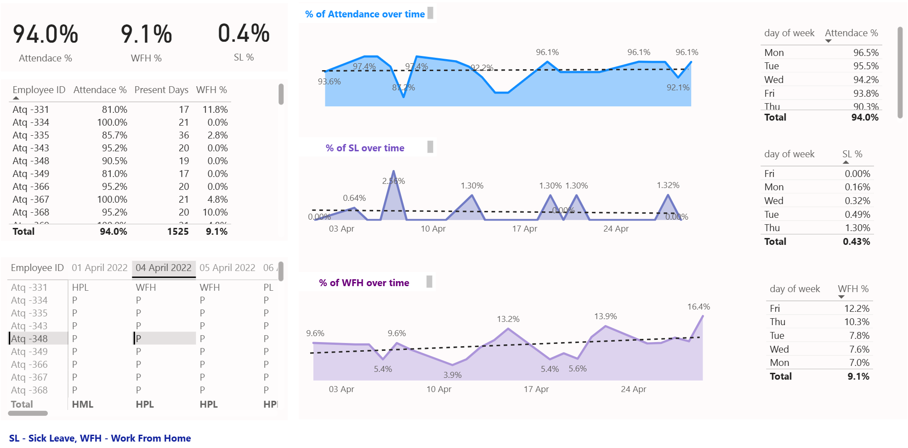
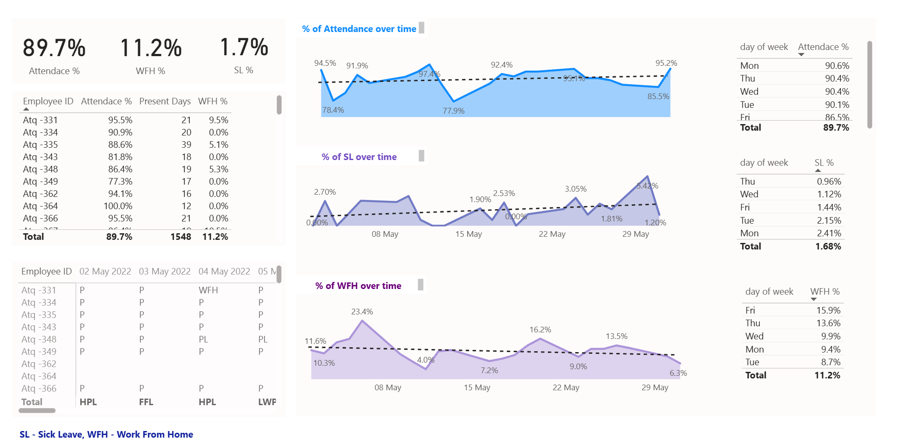
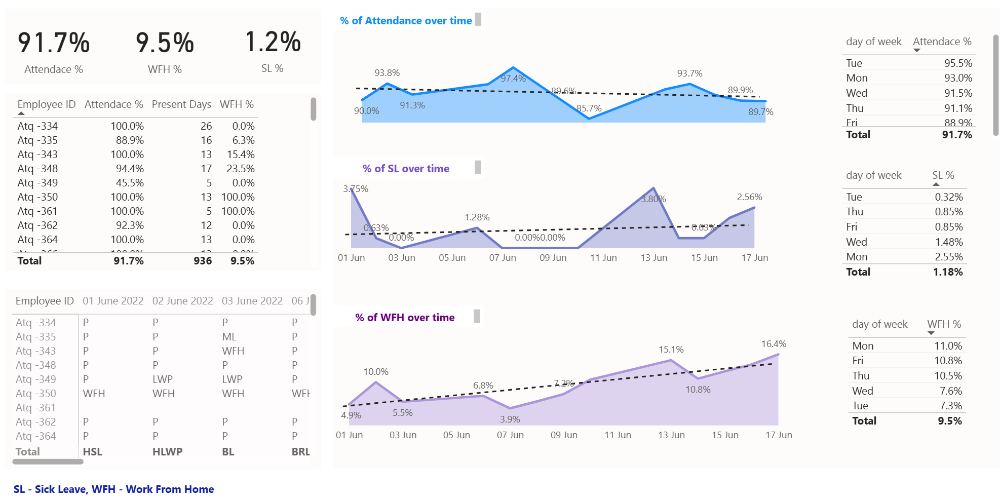

# Employee Attendance, WFH & Sick Leave Analytics Dashboard 📊

## 📌 Project Overview

This project analyzes three months of employee attendance data to understand:
Work From Home (WFH) vs Work From Office (WFO) preferences

Weekly and monthly employee presence patterns

Sick Leave (SL) trends and potential workplace health risks.

---

## 🧠 Key Business Questions

*What are employees’ working preferences between WFH and WFO?
*On which days are employees most and least present in the office?
*How can employee presence insights help plan team activities and collaboration?
*How can hybrid work models improve infrastructure and capacity utilization?
*Are there patterns in sick leave usage that indicate health or safety risks

---

## 🗂 Dataset Summary

* Time Period: 3 Months (April–June 2022)
* Total Employees: ~50+
* Time Granularity: Daily

  Key metrics:

  * Attendance %
  * WFH %
  * Sick Leave (SL %)

   Dimensions
  * Employee ID
  * Date
  * Day of Week
  * Attendance Status (Present, WFH, SL)

---

## 🛠 Tech Stack

* **Python**: pandas, numpy, matplotlib (EDA & data preparation)
* **Power BI**: Data modeling, DAX, dashboarding
* **SQL**: Aggregations & validation
* **GitHub**: Version control & documentation
---

### 1️⃣ April month

### 2️⃣ May month

### 3️⃣June

---

## 📈 Key Insights

*Attendance remained consistently high across three months (≈90–94%)
* WFH usage is highest on Fridays, followed by Mondays
* Mid-week days (Tuesday & Wednesday) show maximum office presence
* Employees prefer WFH at the beginning or end of the workweek
* Sick Leave % remains low overall but shows weekday clustering
* Months with higher WFH show slightly reduced physical attendance, without impacting availability
* April month had highest attendance and least SL%.

---

## 💡 Business Recommendations

* Adopt a structured hybrid model (2 days WFH + 3 days office)
* Encourage office presence on Tuesday–Wednesday for collaboration
* Team-building activities on high-attendance mid-week days to maximize participation

---

## 👤 Made by:

**Usha Nitwal**
---
⭐ If you found this project useful, feel free to star the repository!
